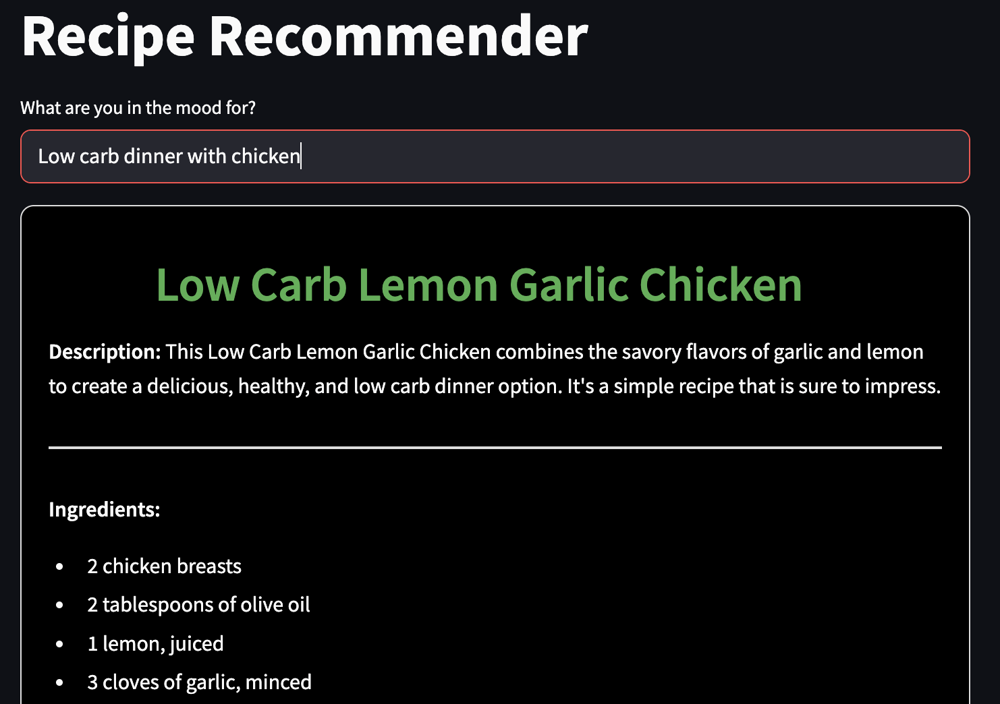
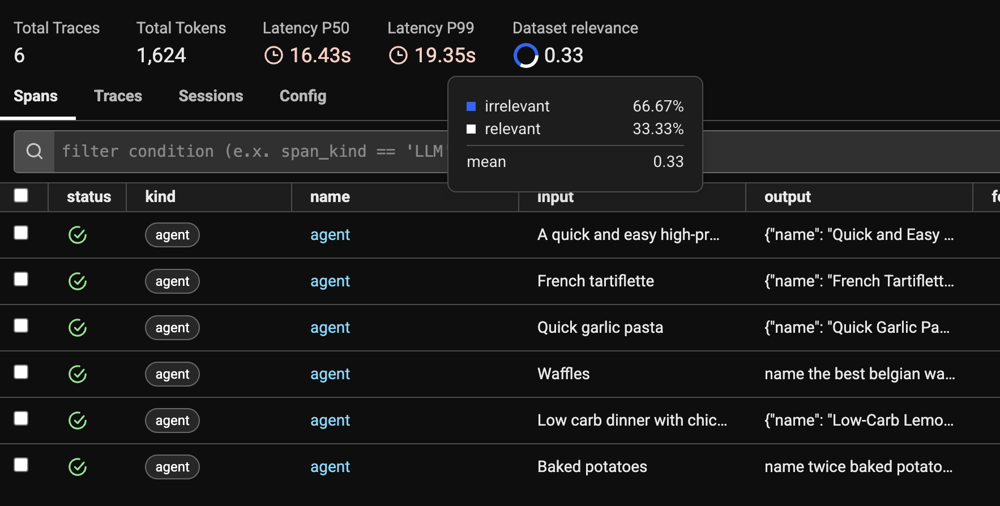
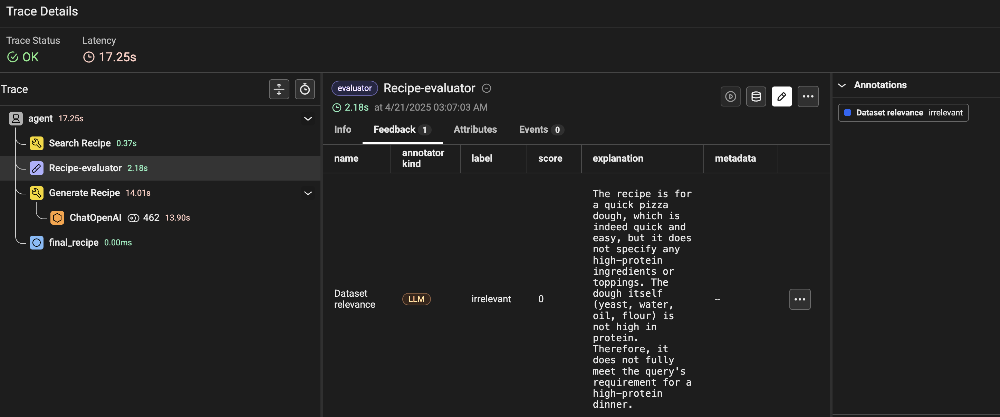

# Recipe Recommender

The **Recipe Recommender** is a smart, semantic-based system built with Python, OpenAI, and LangChain. It provides personalized recipe recommendations based on user queries, combining retrieval and generation techniques.



---

## Goal

The goal of this project was to challenge myself by building a **Retrieval-Augmented Generation (RAG) agent** from scratch. This involved:

1. **Creating a Custom Dataset**: Designed and curated a dataset tailored to recipe recommendations for specific use cases.
2. **Exploring LangChain**: Leveraged & tested LangChain's tools to help me understand complex workflows better
3. **Combining Retrieval and Generation**: Built an agent that integrates semantic search with dynamic recipe generation for personalized results.
4. **Improving Data and Prompts**: Focused on refining the dataset and optimizing prompts to ensure high-quality, relevant recommendations.

---

## Technologies Used

- **OpenAI**: Natural language understanding, semantic processing, and recipe generation.
- **LangChain**: Framework powering the Agent workflow
- **Chroma**: Vector database for semantic search.
- **Pandas**: Data manipulation and analysis.
- **Streamlit**: User Interface Framework.
- **Arize Phoenix**: Monitoring, troubleshooting, and evaluating.

---

## How It Works

1. **User Query**: Input a query like "I want a quick vegan dinner."
2. **Recipe Search**: Search the vector database for relevant recipes.
3. **Relevance Evaluation**: Classify recipes as "relevant" or "irrelevant."
4. **Recipe Generation**: Generate a new recipe if no relevant match is found.
5. **Recipe Display**: Show the recipe with name, description, ingredients, and instructions.

---

## Usage

1. **Install Dependencies**:
   ```bash
   pip install -r requirements.txt
   ```
2. **Set Up Environment Variables**:
   - Add your OpenAI and Phoenix API keys to the `.env` file.
3. **Run the App**:
   ```bash
   streamlit run main.py
   ```

---

## Project Structure

```
recipe_recommender/
├── main.py                # Streamlit app entry point
├── tools.py               # Recipe search and generation tools
├── evaluators.py          # Recipe relevance evaluation
├── utils.py               # Recipe display utilities
├── requirements.txt       # Dependencies
├── output_data/           # Recipe data files
```

---

## Phoenix Tracing and Evals



Phoenix was essential for improving the system:

1. **Dataset Cleaning**: Identified and fixed inconsistencies in the dataset.
2. **Relevance Evaluation**: Ensured only relevant recipes were shown.
3. **Prompt Optimization**: Refined prompts based on LLM feedback.
4. **Debugging**: Traced workflows to optimize performance.


---

## Possible Enhancements

1. **Implementing a Router**: Dynamically select the best tool (search, generation, evaluation) for each query.
2. **Improve Execution Speed**: Persist the Chroma database and optimize Streamlit to avoid reloading modules.
3. **Store Full Recipes**: Include ingredients and instructions in the vector database.
4. **Recipe Validation**: Ensure recipes meet dietary restrictions, ingredient requirements, and time constraints.
5. **User Recipe Ingestion**: Let users add their own recipes to the system.
6. **Better UI**: Add filters, dashboards, and ingredient-based search.
7. **AI-Generated Images**: Use tools like DALL·E to create recipe visuals.
